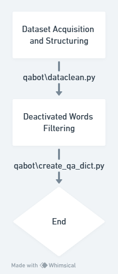
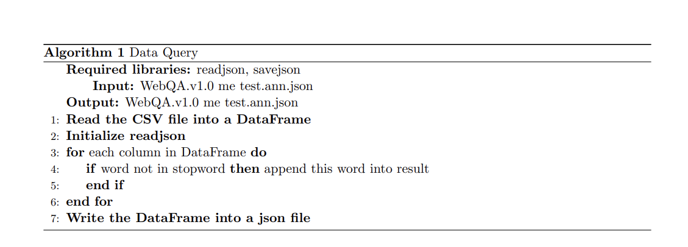

# Data Process
- Dataset Acquisition and Structuring (qabot\dataclean.py): The initial phase involves sourcing a robust dataset from the WebQA.v1.0 repository, which is recognized for its extensive collection of real-world question-answer pairs. This step entails meticulous parsing of the raw data to build a structured Q&A dataset that adheres to the specific requirements of the intended model. The process may include removing irrelevant or redundant information, normalizing text formatting, categorizing questions by type, and ensuring that each entry has a corresponding well-formed question and answer pair.

- Deactivated Words Filtering (qabot\create_qa_dict.py): A crucial aspect of preprocessing is refining the dataset through the filtration of deactivated words. These are typically stop words, punctuation, or any terms identified as noise or not contributing significantly to the semantic meaning within the context of a Q&A system. The create_qa_dict.py script meticulously scans all instances of data, applying a pre-defined list of deactivated words or using automated methods to identify such terms. By doing so, it enhances the signal-to-noise ratio of the content, focusing the model's attention on more informative keywords and phrases. This filtering process also includes handling special cases like contractions, abbreviations, and domain-specific jargon, ultimately refining the dataset to be more conducive for machine learning models to ingest and learn effectively from.
# Reason for the Code:
This code (qabot\dataclean.py and qabot\create_qa_dict.py) plays a critical role in building an intelligent Question Answering (QA) model due to several reasons:

qabot\dataclean.py is responsible for constructing the Q&A dataset from within the WebQA.v1.0 directory. This process involves meticulous cleaning of raw data, which may include removing irrelevant information such as HTML tags, special characters, and standardizing text formats. It ensures that questions are matched with their corresponding answers, resulting in structured and clean data input for the model.
Stop Words Filtering:

qabot\create_qa_dict.py focuses on filtering deactivated words or stop words, which are common words that do not carry significant meaning when used in natural language processing tasks. By eliminating these words, the script enhances the model's ability to focus on keywords and phrases that are more indicative of the actual context and intent behind the question and answer pairs. This step can greatly improve the efficiency and accuracy of the QA model by reducing noise and highlighting important semantic content.
Enhanced Semantic Understanding:

The removal of deactivated words helps to refine the vocabulary space and reduces redundancy, allowing the model to understand the underlying meaning of sentences better. It contributes to creating a condensed representation of the data that can be effectively consumed by machine learning algorithms to learn patterns and relationships between questions and answers.
Customization for Task-Specific Needs:

These scripts often allow for customization based on the specific requirements of the QA task at hand. They can adapt to different types of questions and tailor the preprocessing steps accordingly, ensuring that the model learns from high-quality, domain-specific training data.

- Flow chart

Source:Whimsical
- Flow chart

Source:Whimsical
